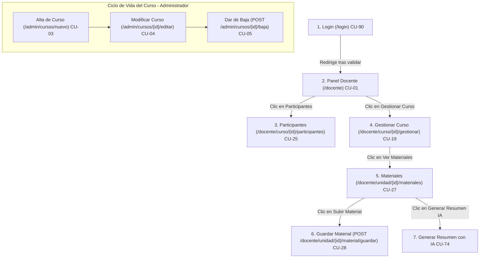

# 📘 RECORRIDO DEL DOCENTE — GUÍA DE DEMOSTRACIÓN COMPLETA
## Sistema Idóneos Online · Plataforma Académica
**Universidad Nacional de Misiones (UNaM) · FCEQyN**
*Autores: Küster Joaquín & Martinez Lazaro Ezequiel (2026)*

---

## 🚀 1. Inicio Rápido

### Comandos de ejecución
* **Git Bash / Linux:** `./mvnw spring-boot:run`
* **PowerShell / CMD:** `.\mvnw.cmd spring-boot:run`
* **URL Base:** http://localhost:8080

### Credenciales de acceso
| Rol | Email | Contraseña |
|:---|:---|:---|
| **Administrador** | `admin@idoneos.online` | `123456` |
| **Docente Titular** | `fausto.spotorno@idoneos.online` | `123456` |
| **Docente Supervisor** | `sebastian.bordato@idoneos.online` | `123456` |
| **Alumno** | `alumno@correo.com` | `123456` |

### Datos pre-cargados por el sistema (SemillaService)
El sistema inserta automáticamente al arrancar:
- **5 cursos:** Mercado de Capitales Argentino · Análisis Macroeconómico · Planificación Fiscal y Tributaria · Valuación de Empresas · Operativa Cripto y DeFi
- **15 alumnos de prueba** inscriptos en distintas cohortes
- **3 unidades** con materiales en el Curso 1 (Mercado de Capitales)
- **2 descuentos:** "Lanzamiento 2026" (15%) · "Comunidad Idóneos" (20%)

---

## 🗺️ 2. Diagrama de Flujo del Recorrido

---

## 📋 3. Recorrido Paso a Paso con Guía de Demostración

---

### 📍 Paso 1 — Login del Docente (`CU-90`)

**¿Qué hace?** El docente ingresa su email y contraseña para autenticarse en el sistema.

#### 🎬 Qué hacer en la pantalla
1. Abrir http://localhost:8080/login
2. Completar el formulario:
   - **Email:** `fausto.spotorno@idoneos.online`
   - **Contraseña:** `123456`
3. Hacer clic en **"Iniciar Sesión"**

#### ✅ Resultado esperado
- Redirige automáticamente a `/docente` (**no** `/docente/mis-cursos`, esa URL no existe)
- El encabezado del sistema muestra **"Fausto Spotorno"**

#### 🗄️ Tablas involucradas
| Tabla | Atributos leídos / escritos | Relación |
|:---|:---|:---|
| `Usuario` | Lee `email`, `contrasena`, `baja`, `email_validado`, `id_rol` | — |
| `Rol` | Lee `nombre` (= "Docente") | `Usuario.id_rol → Rol.id_rol` |
| `Sesion` | Inserta `token`, `fecha_inicio`, `fecha_fin`, `ip`, `dispositivo` | `Sesion.id_usuario → Usuario.id_usuario` |

---

### 📍 Paso 2 — Ver "Mis Cursos" (`CU-01`)

**¿Qué hace?** Muestra todos los cursos donde el docente figura como Titular o Supervisor.

#### 🎬 Qué hacer en la pantalla
1. Ya estás en `/docente` (URL correcta del panel)
2. Observar las tarjetas de cursos de **Fausto Spotorno**:
   - 📘 **Mercado de Capitales Argentino** — $150.000 · Nivel Intermedio
   - 📘 **Análisis Macroeconómico** — Gratuito · Nivel Básico
   - 📘 **Valuación de Empresas** — $180.000 · Nivel Avanzado
3. Escribir `"Mercado"` en la barra de búsqueda para filtrar los cursos

#### ✅ Resultado esperado
- Se filtran las tarjetas en tiempo real
- Cada tarjeta muestra imagen, precio, nivel, categoría y botones de acción

#### 🗄️ Tablas involucradas
| Tabla | Atributos leídos | Relación |
|:---|:---|:---|
| `Curso` | `id_curso`, `nombre`, `descripcion`, `precio`, `imagen`, `baja`, `id_docente` | — |
| `Categoria` | `nombre` (ej: "Mercado de Capitales") | `Curso.id_categoria → Categoria.id_categoria` |
| `Nivel` | `nombre` (ej: "Intermedio") | `Curso.id_nivel → Nivel.id_nivel` |
| `Supervisor` | `id_curso`, `id_docente` | Verifica si el docente es supervisor |
| `ModalidadCurso` | `id_modalidad`, `id_curso` | `ModalidadCurso.id_curso → Curso.id_curso` |

---

### 📍 Paso 3 — Ver Participantes del Curso (`CU-25`)

**¿Qué hace?** Lista todos los alumnos inscriptos en las cohortes del curso.

#### 🎬 Qué hacer en la pantalla
1. En la tarjeta de **"Mercado de Capitales Argentino"**, hacer clic en **"Ver Participantes"**
2. URL resultante: `/docente/curso/1/participantes`
3. Deben aparecer estos alumnos de prueba del SemillaService:

| Nombre | Email | DNI | Observación |
|:---|:---|:---|:---|
| Carlos Gómez | carlos.gomez@test.com | 28111222 | Con certificado CERT-2026-1000 |
| Lucía Fernández | lucia.fernandez@test.com | 32333444 | Inscripción vigente |
| Valeria Ríos | valeria.rios@test.com | 35999000 | Inscripción vigente |
| Gonzalo Benítez | gonzalo.benitez@test.com | 37000111 | Inscripción vigente |
| Ignacio Castro | ignacio.castro@test.com | 34456789 | Inscripción vigente |

#### ✅ Resultado esperado
- Lista de alumnos con nombre, email, DNI, estado y fecha de inscripción
- Carlos Gómez aparece con certificado emitido

#### 🗄️ Tablas involucradas
| Tabla | Atributos leídos | Relación |
|:---|:---|:---|
| `Cohorte` | `id_cohorte`, `fecha_inicio_inscripcion`, `id_programa` | `Cohorte.id_programa → Programa.id_programa` |
| `Programa` | `id_programa`, `id_curso` | `Programa.id_curso → Curso.id_curso` |
| `Inscripcion` | `id_inscripcion`, `fecha`, `numero_certificado`, `baja` | `Inscripcion.id_cohorte → Cohorte.id_cohorte` |
| `Alumno` | `id_alumno` | `Inscripcion.id_alumno → Alumno.id_alumno` |
| `Usuario` | `nombre`, `apellido`, `email`, `dni` | `Alumno.id_usuario → Usuario.id_usuario` |
| `Progreso` | `completada`, `fecha_completada` | `Progreso.id_inscripcion → Inscripcion.id_inscripcion` |

---

### 📍 Paso 4 — Ver Unidades del Temario (`CU-19`)

**¿Qué hace?** Muestra el programa vigente del curso y sus unidades en orden.

#### 🎬 Qué hacer en la pantalla
1. Volver al **Panel Docente** (`/docente`) → tarjeta de **"Mercado de Capitales Argentino"**
2. Hacer clic en **"Gestionar Curso"**
3. URL resultante: `/docente/curso/1/gestionar`
4. Observar las 3 unidades pre-cargadas:

| # | Título | Duración |
|:---|:---|:---|
| 1 | Introducción al Sistema Financiero | 4 semanas |
| 2 | Renta Fija: Bonos y ONs | 4 semanas |
| 3 | Renta Variable y CEDEARs | 4 semanas |

#### ✅ Resultado esperado
- Las unidades se listan en orden según `numero_orden` del Cronograma
- Botones para Materiales, Autoevaluaciones y Glosario por unidad

#### 🗄️ Tablas involucradas
| Tabla | Atributos leídos | Relación |
|:---|:---|:---|
| `Programa` | `id_programa`, `nombre`, solo `baja = false` | `Programa.id_curso → Curso.id_curso` |
| `Cronograma` | `id`, `numero_orden`, `semanas_duracion`, `id_unidad` | `Cronograma.id_programa → Programa.id_programa` |
| `Unidad` | `id_unidad`, `titulo`, `descripcion`, `baja` | `Cronograma.id_unidad → Unidad.id_unidad` |

---

### 📍 Paso 5 — Ver Materiales de la Unidad (`CU-27`)

**¿Qué hace?** Lista los archivos, grabaciones y presentaciones cargados en esa unidad.

#### 🎬 Qué hacer en la pantalla
1. Desde `/docente/curso/1/gestionar`, hacer clic en **"Ver Materiales"** en la **Unidad 1** (Introducción al Sistema Financiero)
2. URL resultante: `/docente/unidad/1/materiales`
3. Observar los 3 materiales pre-cargados:

| Ícono | Nombre | Tipo | Estado |
|:---|:---|:---|:---|
| 🎬 | Clase Grabada - Módulo 1 | Grabación | oculto |
| 📚 | Ley de Mercado de Capitales 26.831 | Bibliografía | oculto |
| 📊 | Diapositivas Unidad 1 | Presentación | oculto |

4. Hacer clic en **"Publicar"** sobre **"Diapositivas Unidad 1"**

#### ✅ Resultado esperado
- Al publicar, cambia a `oculto: false` y los alumnos ya pueden verlo

#### 🗄️ Tablas involucradas
| Tabla | Atributos leídos | Relación |
|:---|:---|:---|
| `Unidad` | `id_unidad`, `titulo` | — |
| `Material` | `id_material`, `titulo`, `ruta_archivo`, `oculto`, `generado_por_ia`, `fecha_creacion` | `Material.id_unidad → Unidad.id_unidad` |
| `TipoMaterial` | `nombre` (Grabación / Bibliografía / Presentación / Resumen) | `Material.id_tipo_material → TipoMaterial.id_tipo_material` |
| `Docente` | `id_docente` (autor del material) | `Material.id_docente → Docente.id_docente` |

---

### 📍 Paso 6 — Subir Material Pedagógico (`CU-28`)

**¿Qué hace?** El docente sube manualmente un nuevo archivo a la unidad.

#### 🎬 Qué hacer en la pantalla
1. Desde `/docente/unidad/1/materiales`, completar el formulario integrado en pantalla
2. El formulario hace `POST` a `/docente/unidad/1/material/guardar`
3. Completar con estos datos de prueba:

| Campo | Valor de prueba |
|:---|:---|
| **Título** | `Normativa CNV 2026` |
| **Tipo** | `Bibliografía` |
| **Autor** | `Comisión Nacional de Valores` |
| **Archivo / URL** | `https://www.cnv.gob.ar/normativa/2026.pdf` |

4. Hacer clic en **"Guardar Material"**

#### ✅ Resultado esperado
- Redirige a `/docente/unidades/1/materiales`
- Aparece el nuevo material con `oculto: true` (pendiente revisión)

#### 🗄️ Tablas — Inserción
| Tabla | Atributos insertados |
|:---|:---|
| `Material` | `titulo = "Normativa CNV 2026"`, `id_tipo_material = 2 (Bibliografía)`, `autor = "CNV"`, `ruta_archivo = "..."`, `generado_por_ia = false`, `oculto = true`, `id_unidad = 1`, `id_docente = [Fausto]` |

---

### 📍 Paso 7 — Generar Resumen con IA (`CU-74`)

**¿Qué hace?** La IA lee la bibliografía de la unidad y genera automáticamente un resumen estructurado.

#### 🎬 Qué hacer en la pantalla
1. Volver a `/docente/unidad/1/materiales`
2. Hacer clic en **"Generar Resumen con IA"**
3. Esperar la respuesta del modelo (Ollama/Llama en `http://localhost:11434`)

> **Nota:** Si Ollama no está corriendo localmente, el sistema muestra un mensaje de error controlado. Ollama debe estar instalado y ejecutándose con el modelo `llama3.1`.

#### ✅ Resultado esperado
Aparece un nuevo material en la lista:
- **Título:** `"Resumen IA - Introducción al Sistema Financiero"`
- **Tipo:** Resumen · **Generado por IA:** sí · **Estado:** oculto (pendiente de aprobación del docente)

#### 🗄️ Tablas involucradas
| Tabla | Operación | Detalle |
|:---|:---|:---|
| `Material` | **Lectura** | Filtra `id_unidad = 1` y `tipo_material = Bibliografía` |
| `Material` | **Inserción** | `titulo = "Resumen IA - ..."`, `generado_por_ia = true`, `oculto = true`, `id_tipo_material = 4 (Resumen)` |

---

### 📍 Paso 8 — Ciclo Administrativo: Alta, Modificación y Baja de Curso

> ⚠️ **Cerrar sesión** como docente e iniciar sesión como **Administrador:**
> Email: `admin@idoneos.online` | Contraseña: `123456`

---

#### 🔹 8.A — Registrar un Curso Nuevo (`CU-03`)

**¿Qué hace?** Da de alta un nuevo curso en el sistema.

##### 🎬 Qué hacer en la pantalla
1. Ir a `/admin/cursos` → clic en **"Nuevo Curso"**
2. URL real: `/admin/cursos/nuevo`
3. Completar con estos datos de prueba:

| Campo | Valor |
|:---|:---|
| **Nombre** | `Introducción a las Criptomonedas` |
| **Descripción** | `Conceptos básicos de Bitcoin, Ethereum y wallets.` |
| **Precio** | `90000` |
| **Categoría** | `Mercado de Capitales` |
| **Nivel** | `Básico` |
| **Modalidad** | Grabada |
| **Emite certificado** | Activar |
| **Docente Titular** | `Fausto Spotorno` |
| **Docente Supervisor** | `Sebastián Bordato` |

4. Clic en **"Guardar Curso"**

##### ✅ Resultado esperado
- Aparece en `/admin/cursos` y en `/docente/mis-cursos` de Fausto
- Estado inicial: `baja = false`, `publicado = false`

##### 🗄️ Tablas insertadas
| Tabla | Atributos |
|:---|:---|
| `Curso` | `nombre`, `descripcion`, `precio`, `id_categoria`, `id_nivel`, `id_docente`, `emite_certificado = true`, `baja = false` |
| `ModalidadCurso` | `id_modalidad = 2 (Grabada)`, `id_curso = [nuevo]` |
| `Supervisor` | `id_curso = [nuevo]`, `id_docente = [Bordato]` |

---

#### 🔹 8.B — Modificar el Curso (`CU-04`)

**¿Qué hace?** Edita el curso. Los campos disponibles dependen de si tiene alumnos inscriptos.

##### 🎬 Dos escenarios a demostrar

**Escenario A — Sin alumnos** (usar "Introducción a las Criptomonedas"):
1. Ir a `/admin/cursos/{id}/editar` del curso nuevo
2. Cambiar precio a `75000`
3. Cambiar descripción a `"Bitcoin, Ethereum, DeFi y NFTs para principiantes."`
4. Hacer `POST` a `/admin/cursos/{id}/editar` → Todos los campos se actualizan ✅

**Escenario B — Con alumnos inscriptos** (usar "Mercado de Capitales Argentino"):
1. Ir a `/admin/cursos/{id}/editar` del curso con alumnos
2. El campo **nombre** está bloqueado ⛔ (tiene alumnos activos)
3. Solo `precio` e `imagen` son editables
4. Cambiar precio a `165000` → Guarda correctamente ✅

---

#### 🔹 8.C — Dar de Baja el Curso (`CU-05`)

**¿Qué hace?** Baja lógica: el curso desaparece del catálogo pero el historial se conserva.

##### 🎬 Qué hacer en la pantalla
1. Ir a `/admin/cursos` → localizar **"Introducción a las Criptomonedas"**
2. Enviar `POST` a `/admin/cursos/{id}/baja` → confirmar
3. Para demostrar el bloqueo: intentar dar de baja **"Mercado de Capitales Argentino"** → el sistema rechaza con error ⛔

##### ✅ Resultado esperado
- "Introducción a las Criptomonedas" desaparece del catálogo y de Mis Cursos
- En BD: `baja = true`, resto de atributos intactos para histórico

##### 🗄️ Tabla modificada
| Tabla | Atributo | Valor |
|:---|:---|:---|
| `Curso` | `baja` | `true` |

---

## 🗄️ 4. Resumen de Tablas — Atributos y Relaciones

| Tabla | Atributos principales | Claves Foráneas | Usada en CU |
|:---|:---|:---|:---|
| `Usuario` | `id_usuario`, `email`, `contrasena`, `nombre`, `apellido`, `dni`, `baja`, `email_validado` | `id_rol → Rol` | 90, 25 |
| `Rol` | `id_rol`, `nombre` | — | 90 |
| `Docente` | `id_docente`, `anios_experiencia`, `biografia`, `habilitado`, `avatar_id`, `voice_id` | `id_usuario → Usuario` | 01, 03, 25 |
| `Administrador` | `id_administrador` | `id_usuario → Usuario` | 03, 04, 05 |
| `Alumno` | `id_alumno` | `id_usuario → Usuario` | 25 |
| `Sesion` | `id_sesion`, `token`, `fecha_inicio`, `fecha_fin`, `ip`, `dispositivo` | `id_usuario → Usuario` | 90 |
| `Curso` | `id_curso`, `nombre`, `descripcion`, `precio`, `imagen`, `emite_certificado`, `baja`, `publicado` | `id_categoria → Categoria`, `id_nivel → Nivel`, `id_docente → Docente` | 01, 03, 04, 05 |
| `Categoria` | `id_categoria`, `nombre`, `descripcion` | — | 01, 03 |
| `Nivel` | `id_nivel`, `nombre` | — | 01, 03 |
| `Modalidad` | `id_modalidad`, `nombre` | — | 03, 04 |
| `ModalidadCurso` | `id_modalidad`, `id_curso` | `→ Modalidad`, `→ Curso` | 01, 03, 04 |
| `Supervisor` | `id`, `id_curso`, `id_docente` | `→ Curso`, `→ Docente` | 01, 03, 25 |
| `Programa` | `id_programa`, `nombre`, `objetivos`, `bibliografia`, `carga_horaria_total`, `baja` | `id_curso → Curso` | 19, 05 |
| `Cronograma` | `id`, `numero_orden`, `semanas_duracion` | `id_programa → Programa`, `id_unidad → Unidad` | 19 |
| `Unidad` | `id_unidad`, `titulo`, `descripcion`, `contenido`, `baja` | — | 19, 27, 28, 74 |
| `TipoMaterial` | `id_tipo_material`, `nombre` (Grabación / Bibliografía / Presentación / Resumen) | — | 27, 28 |
| `Material` | `id_material`, `titulo`, `ruta_archivo`, `autor`, `generado_por_ia`, `oculto`, `baja` | `id_tipo_material → TipoMaterial`, `id_unidad → Unidad`, `id_docente → Docente` | 27, 28, 74 |
| `Cohorte` | `id_cohorte`, `fecha_inicio_inscripcion`, `fecha_fin_inscripcion`, `cupo_maximo`, `semanas_acceso`, `baja` | `id_programa → Programa` | 25, 04, 05 |
| `Inscripcion` | `id_inscripcion`, `fecha`, `fecha_vencimiento_acceso`, `numero_certificado`, `baja` | `id_cohorte → Cohorte`, `id_alumno → Alumno` | 25, 02 |
| `Progreso` | `id_progreso`, `completada`, `fecha_completada` | `id_unidad → Unidad`, `id_inscripcion → Inscripcion` | 25, 02 |

---

## 🖨️ Exportar a PDF

1. **VS Code:** clic derecho sobre el archivo → `Markdown PDF: Export (pdf)`
2. **Navegador:** `Ctrl+Shift+V` para vista previa → `Ctrl+P` → Guardar como PDF (activar *Gráficos de fondo*)
